# publii.resdigita.com Publii wesite

Publii est un système de gestion de contenu ici:

<https://getpublii.com/>

Pour l'installer, sous Linux, Publii est un logiciel local qui utilise le dossier local ~/Documents/Publii.

## Installer la langue française

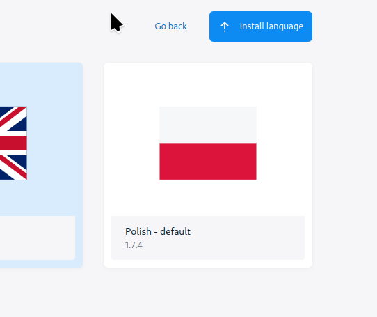

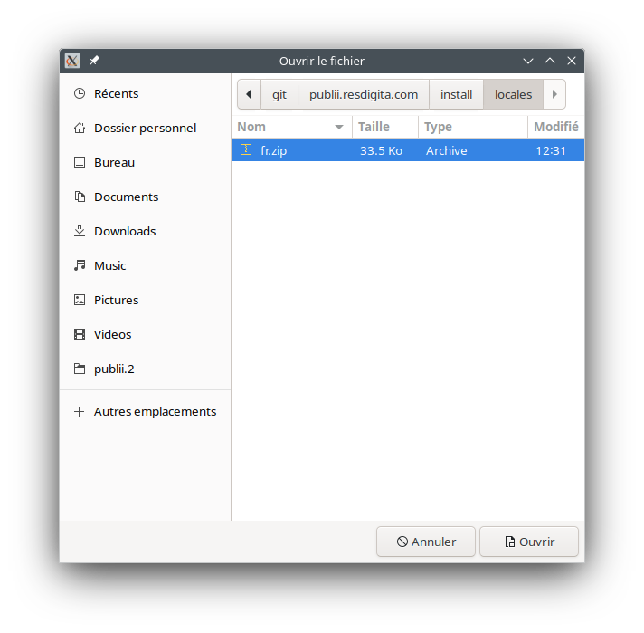

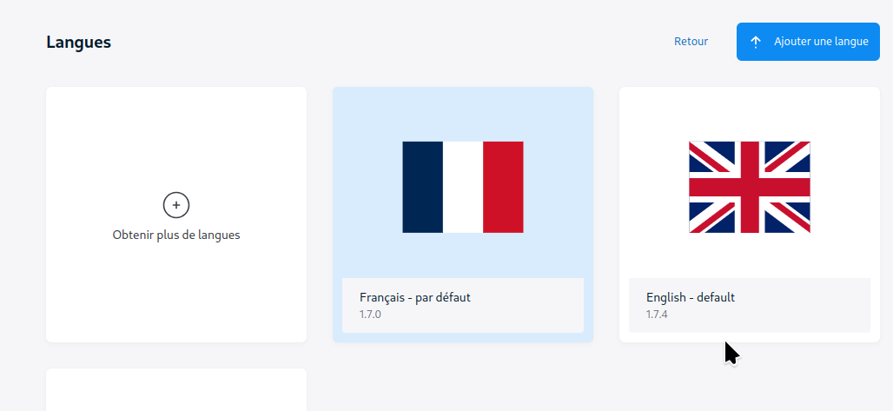

## Parameter Publii pour utiliser les dossiers de git

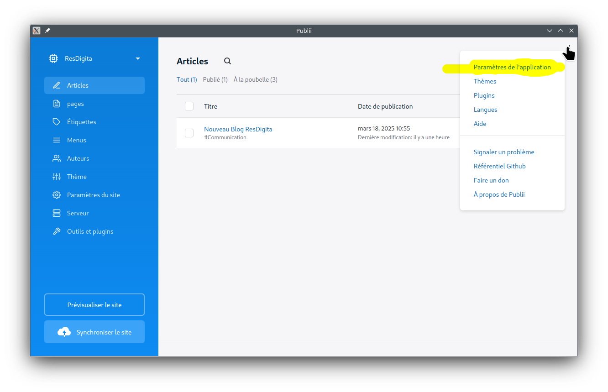

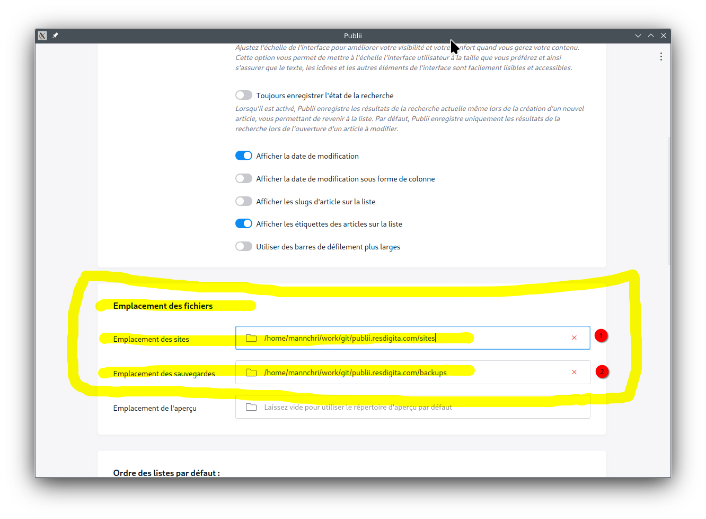

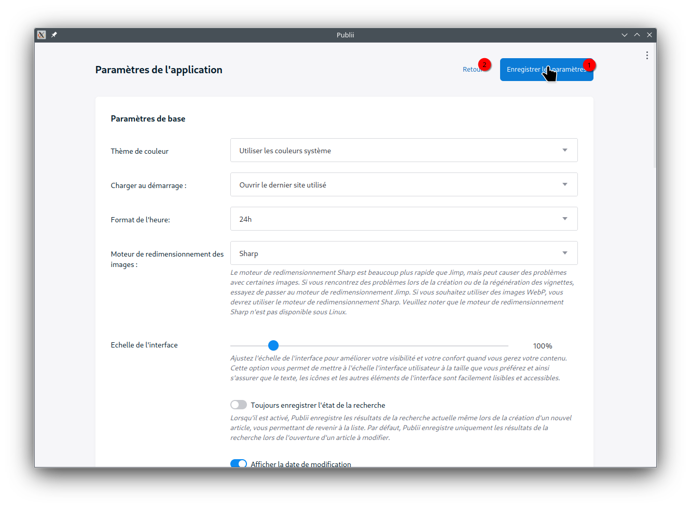

## Installer le thème Square (ou d'autres)

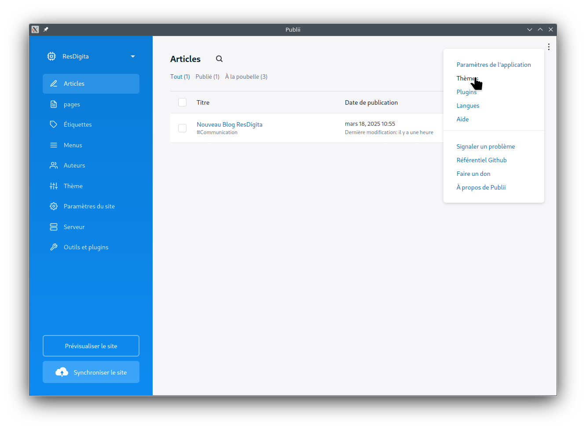

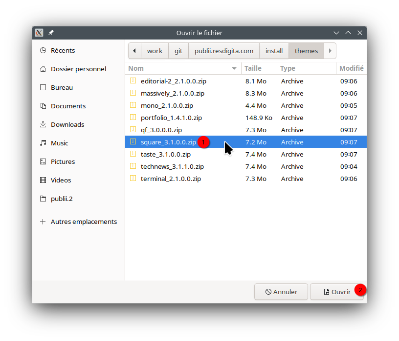

## Restaurer depuis une sauvegarde (backup)

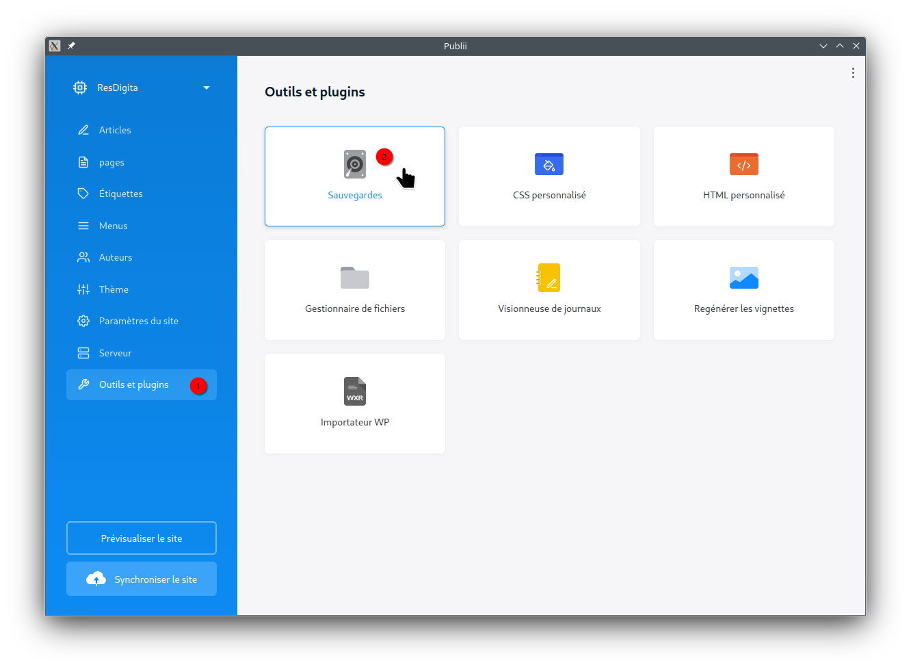

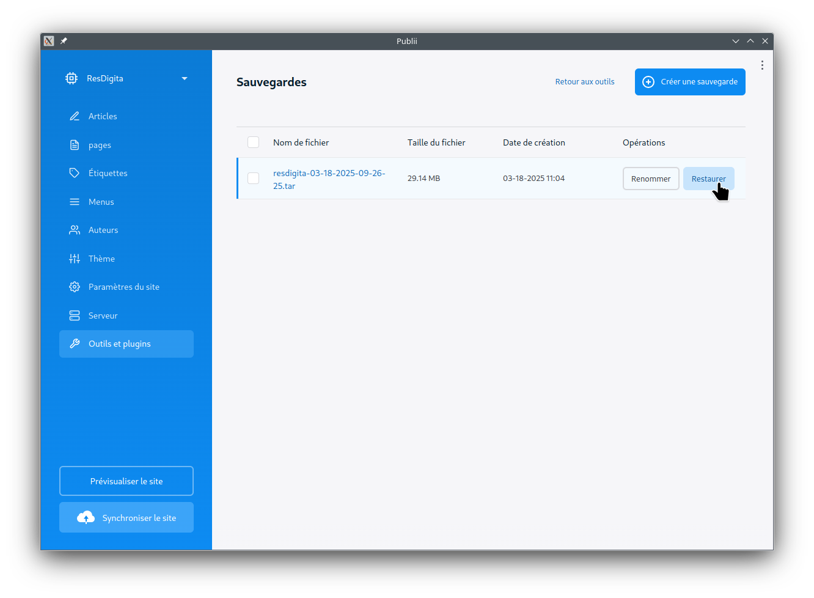

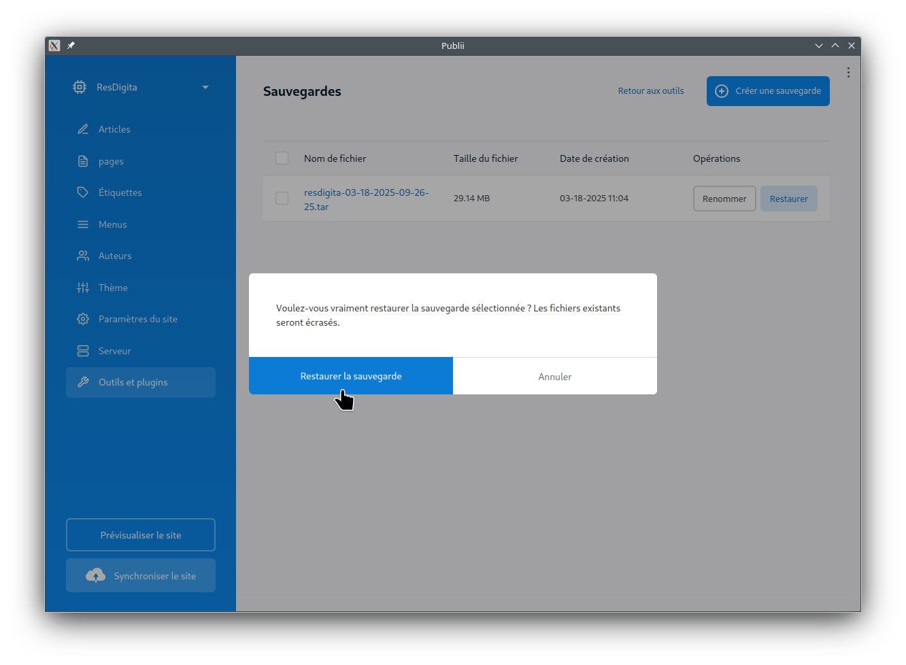

## Faire une sauvegarde (backup)

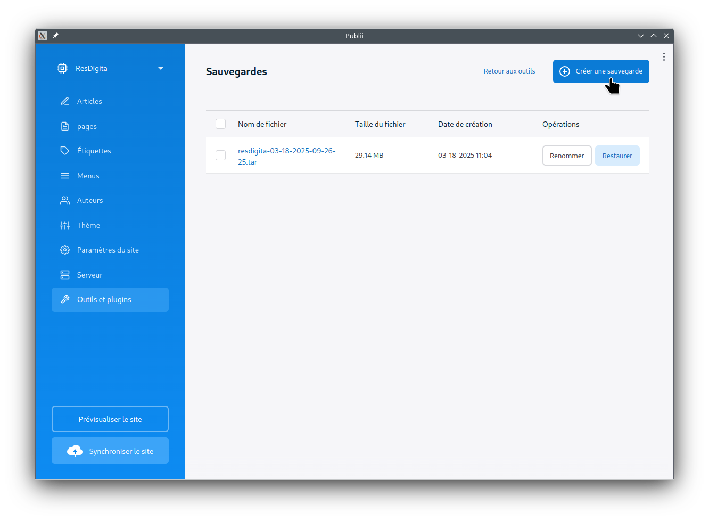

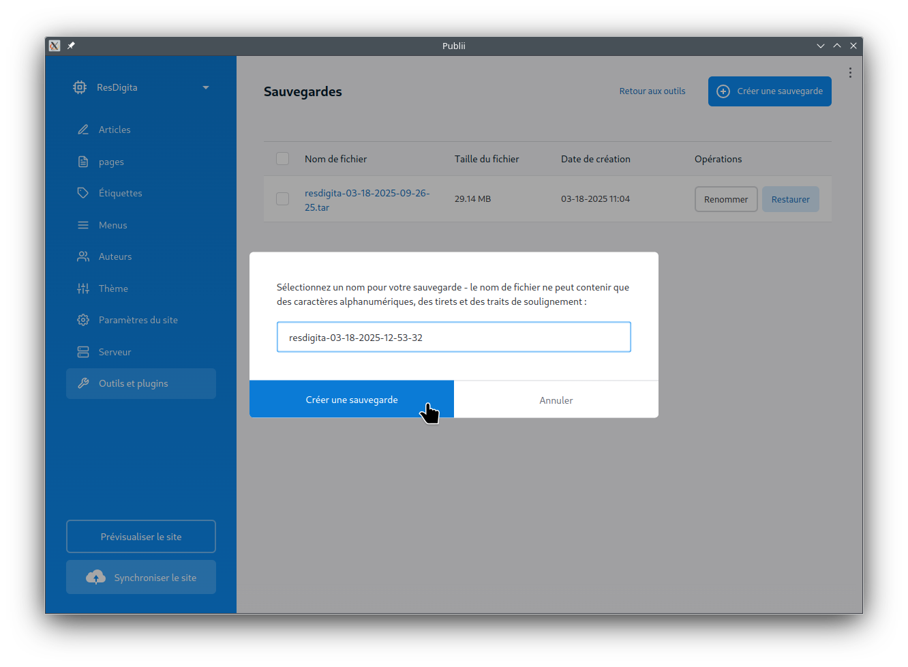

## Langues

<https://github.com/GetPublii/Publii-ui-locales>

<https://github.com/GetPublii/Publii-ui-locales/blob/main/downloads/0.46.0/fr.zip>

## Thèmes

<https://marketplace.getpublii.com/themes/>

<https://marketplace.getpublii.com/themes/square/>